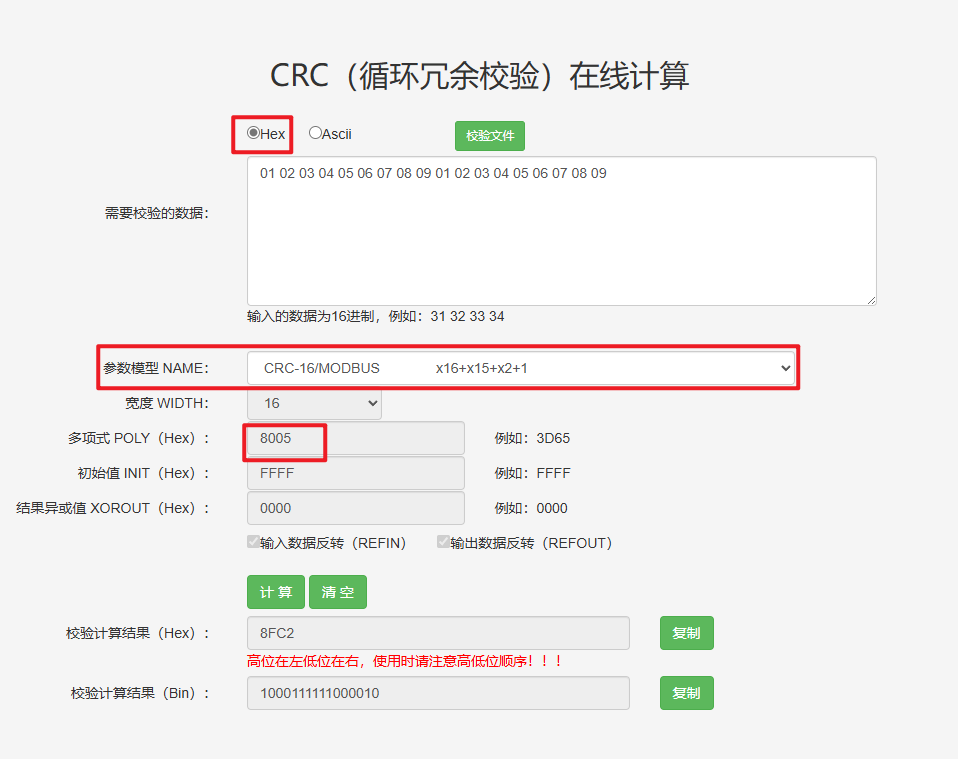

<!--
 Copyright (C) 2024 wwhai

 This program is free software: you can redistribute it and/or modify
 it under the terms of the GNU Affero General Public License as
 published by the Free Software Foundation, either version 3 of the
 License, or (at your option) any later version.

 This program is distributed in the hope that it will be useful,
 but WITHOUT ANY WARRANTY; without even the implied warranty of
 MERCHANTABILITY or FITNESS FOR A PARTICULAR PURPOSE.  See the
 GNU Affero General Public License for more details.

 You should have received a copy of the GNU Affero General Public License
 along with this program.  If not, see <https://www.gnu.org/licenses/>.
-->
# ATK-LORA-01


ATK-LORA-01 一款体积小、微功率、低功耗、高性能远距离 LORA 无线串口模块。模块设计是采用高效的 ISM 频段射频 SX1278 扩频芯片，模块的工作频率在 410Mhz~441Mhz，以 1Mhz 频率为步进信道，共 32 个信道。可通过 AT 指令在线修改串口速率，发射功率，空中速率，工作模式等各种参数，并且支持固件升级功能。

## Topic
| Topic               | Args | Result(HTTP返回JSON里的data字段) |
| ------------------- | ---- | -------------------------------- |
| lora.atk01.cmd.send | ""   | String                           |

## 协议

### 协议结构

1. **起始标识符**:
   - **固定值**: `EE EF`
   - **含义**: 表示协议数据包的起始。在解析数据包时，用于确认协议的开始。

2. **数据块**:
   - **长度**: 固定长度为 `18` 个字节。
   - **结构**: 包含以下字段：
     - `Byte 1`: 数据块标识符（示例中为 `01`）
     - `Byte 2-9`: 数据内容，具体含义根据协议定义而定（示例中为 `02 03 04 05 06 07 08 09`）
     - `Byte 10-18`: 重复的数据内容，与前面的数据内容相同（示例中为 `01 02 03 04 05 06 07 08 09`）

3. **CRC**:
   

   - **值**: `8F C2`
   - **含义**: CRC校验值


4. **协议结束符**:
   - **固定值**: `0D 0A`
   - **含义**: 表示协议数据包的结束。在解析数据时，用于确认协议数据包的完整性。

### 示例

假设我们有如下二进制数据：

```
EE EF 01 02 03 04 05 06 07 08 09 01 02 03 04 05 06 07 08 09 8F C2 0D 0A
```

- `EE EF`: 起始标识符
- `01`: 数据块标识符
- `02 03 04 05 06 07 08 09`: 数据块内容（第一部分）
- `01 02 03 04 05 06 07 08 09`: 数据块内容（第二部分）
- `8F C2`: CRC校验值
- `0D 0A`: 协议结束符

### 实现建议

1. **解析步骤**:
   - 从数据流中读取并验证起始标识符 `EE EF`。
   - 读取并解析数据块，将 `Byte 1` 作为数据块标识符，依次读取 `Byte 2-9` 和 `Byte 10-18` 作为数据块内容。
   - 确认CRC校验值 `8F C2`，以验证数据块的结束和协议的完整性。
   - 最后确认协议结束符 `0D 0A`，以确认协议数据包的完整性。

2. **注意事项**:
   - 确保按照固定长度读取和解析数据块，以及正确处理数据块的顺序和标识符的唯一性。
   - 在处理结束符时，注意不要将它误解为数据块的一部分。

## 案例
```c
/*
Arduino UNO软串口通信
*/
#include <Arduino.h>
#include <SoftwareSerial.h>
SoftwareSerial atk01(2, 3); // RX, TX

void setup()
{
  Serial.begin(9600);
  while (!Serial)
  {
  }
  atk01.begin(9600);
}
const uint8_t data1[] = {
    (uint8_t)0xEE,
    (uint8_t)0xEF,
    (uint8_t)0x01,
    (uint8_t)0x03,
    (uint8_t)0x00,
    (uint8_t)0x00,
    (uint8_t)0x00,
    (uint8_t)0x02,
    (uint8_t)0x04,
    (uint8_t)0xD2,
    (uint8_t)0x16,
    (uint8_t)0xE2,
    (uint8_t)0xD2,
    (uint8_t)0x63,
    (uint8_t)0x0D,
    (uint8_t)0x0A,
};
const uint8_t data2[] = {
    (uint8_t)0xEE,
    (uint8_t)0xEF,
    (uint8_t)0x01,
    (uint8_t)0x03,
    (uint8_t)0x63,
    (uint8_t)0x0D,
    (uint8_t)0x0A,
};
void loop()
{
  for (size_t i = 0; i < 16; i++)
  {
    atk01.write(data1[i]);
  }
  for (size_t i = 0; i < 7; i++)
  {
    atk01.write(data2[i]);
  }
  for (size_t i = 0; i < 16; i++)
  {
    atk01.write(data1[i]);
  }
  for (size_t i = 0; i < 7; i++)
  {
    atk01.write(data2[i]);
  }
  delay(10);
}

```