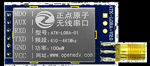

<!--
 Copyright (C) 2024 wwhai

 This program is free software: you can redistribute it and/or modify
 it under the terms of the GNU Affero General Public License as
 published by the Free Software Foundation, either version 3 of the
 License, or (at your option) any later version.

 This program is distributed in the hope that it will be useful,
 but WITHOUT ANY WARRANTY; without even the implied warranty of
 MERCHANTABILITY or FITNESS FOR A PARTICULAR PURPOSE.  See the
 GNU Affero General Public License for more details.

 You should have received a copy of the GNU Affero General Public License
 along with this program.  If not, see <https://www.gnu.org/licenses/>.
-->
# ATK-LORA-01

ATK-LORA-01 一款体积小、微功率、低功耗、高性能远距离 LORA 无线串口模块。模块设计是采用高效的 ISM 频段射频 SX1278 扩频芯片，模块的工作频率在 410Mhz~441Mhz，以 1Mhz 频率为步进信道，共 32 个信道。可通过 AT 指令在线修改串口速率，发射功率，空中速率，工作模式等各种参数，并且支持固件升级功能。

## Topic
| Topic               | Args | Result(HTTP返回JSON里的data字段) |
| ------------------- | ---- | -------------------------------- |
| lora.atk01.cmd.send | ""   | String                           |


为了实现命令下发后节点的回复报文，并引入报文ID以便跟踪和管理通信，我们可以进一步扩展协议。以下是更新后的协议设计：

## LoRa通信协议设计文档

### 概述

本协议设计用于在LoRa网络中实现子节点与网关之间的双向通信，包括子节点主动上报数据、网关下发命令以及节点对命令的回复。协议采用简单的二进制格式，易于实现和解析。

### 协议结构

| 字段名     | 字节数 | 描述                                                           |
| ---------- | ------ | -------------------------------------------------------------- |
| 起始标志   | 1      | 指示数据包的开始，固定值`0xFF`                                 |
| 报文类型   | 1      | 区分报文类型，主动上报(`0x01`)、命令下发(`0x02`)或回复(`0x03`) |
| 设备ID     | 1      | 唯一标识发送或接收数据的设备，范围`0x00`至`0xFF`               |
| 报文ID     | 2      | 用于跟踪特定报文的唯一标识符，范围`0x0000`至`0xFFFF`           |
| 数据包长度 | 1      | 后续数据包内容的长度，范围`0x00`至`0xFF`（最大255字节）        |
| 数据包内容 | 变长   | 实际传输的数据                                                 |
| CRC校验    | 2      | 数据包的CRC-16校验值                                           |
| 结束标志   | 1      | 指示数据包的结束，固定值`0xFE`                                 |

### 报文类型

| 类型值 | 类型名称 | 描述                   |
| ------ | -------- | ---------------------- |
| `0x01` | 主动上报 | 子节点向网关发送的数据 |
| `0x02` | 命令下发 | 网关向子节点发送的命令 |
| `0x03` | 回复     | 节点对网关命令的响应   |

### 示例数据包

#### 主动上报示例

| 字段名     | 值           |
| ---------- | ------------ |
| 起始标志   | `0xFF`       |
| 报文类型   | `0x01`       |
| 设备ID     | `0x01`       |
| 报文ID     | `0x0000`     |
| 数据包长度 | `0x10`       |
| 数据包内容 | [...数据...] |
| CRC校验    | `0xABCD`     |
| 结束标志   | `0xFE`       |

#### 命令下发明细

| 字段名     | 值           |
| ---------- | ------------ |
| 起始标志   | `0xFF`       |
| 报文类型   | `0x02`       |
| 设备ID     | `0x01`       |
| 报文ID     | `0x0001`     |
| 数据包长度 | `0x08`       |
| 数据包内容 | [...命令...] |
| CRC校验    | `0xEF12`     |
| 结束标志   | `0xFE`       |

#### 回复报文示例

| 字段名     | 值           |
| ---------- | ------------ |
| 起始标志   | `0xFF`       |
| 报文类型   | `0x03`       |
| 设备ID     | `0x01`       |
| 报文ID     | `0x0001`     |
| 数据包长度 | `0x04`       |
| 数据包内容 | [...响应...] |
| CRC校验    | `0x1234`     |
| 结束标志   | `0xFE`       |

### 注意事项

- 在发送数据包之前，必须在发送端计算CRC校验值，并在接收端进行验证。
- 数据包内容的长度和类型应符合LoRa的有效负载限制。
- 协议设计应尽可能减少不必要的字段和开销，以提高通信效率。
- 可根据实际应用需求调整协议字段的大小和数量。
- 在实际部署前，应在多种环境和条件下测试协议的稳定性和可靠性。

## 协议示例
为了实现设备主动上报、网关下发命令和设备回复这三个报文的功能，我们可以创建三个不同的函数，每个函数负责构造相应类型的报文。以下是一个示例，展示了如何在C语言中实现这些功能：

```c
#include <stdint.h>
#include <string.h>

// 定义报文结构体
typedef struct {
    uint8_t start_flag;
    uint8_t message_type;
    uint8_t device_id;
    uint16_t message_id;
    uint8_t data_length;
    char data[255]; // 假设数据包内容的最大长度为255字节
    uint16_t crc;
    uint8_t end_flag;
} Packet;

// 假设已经有一个名为crc16的函数可用
uint16_t crc16(const uint8_t *data, size_t length);

// 初始化报文结构体的函数
void init_packet(Packet *packet, uint8_t type, uint8_t device_id, uint16_t id, const char *data, size_t data_length) {
    packet->start_flag = 0xFF;
    packet->message_type = type;
    packet->device_id = device_id;
    packet->message_id = id;
    packet->data_length = data_length;
    memcpy(packet->data, data, data_length);
    packet->crc = crc16((uint8_t *)packet, sizeof(Packet) - 2); // 减2是为了排除end_flag和crc字段
    packet->end_flag = 0xFE;
}

// 打印报文内容的函数
void print_packet(const Packet *packet) {
    printf("Start Flag: 0x%02X\n", packet->start_flag);
    printf("Message Type: %u\n", packet->message_type);
    printf("Device ID: %u\n", packet->device_id);
    printf("Message ID: %u\n", packet->message_id);
    printf("Data Length: %u\n", packet->data_length);
    printf("Data: %s\n", packet->data);
    printf("CRC: 0x%04X\n", packet->crc);
    printf("End Flag: 0x%02X\n", packet->end_flag);
}

// 构造主动上报报文的函数
Packet construct_report_packet(uint8_t device_id, uint16_t id, const char *data, size_t data_length) {
    Packet report_packet;
    init_packet(&report_packet, 0x01, device_id, id, data, data_length);
    return report_packet;
}

// 构造网关下发命令报文的函数
Packet construct_command_packet(uint8_t device_id, uint16_t id, const char *data, size_t data_length) {
    Packet command_packet;
    init_packet(&command_packet, 0x02, device_id, id, data, data_length);
    return command_packet;
}

// 构造设备回复报文的函数
Packet construct_reply_packet(uint8_t device_id, uint16_t id, const char *data, size_t data_length) {
    Packet reply_packet;
    init_packet(&reply_packet, 0x03, device_id, id, data, data_length);
    return reply_packet;
}

int main() {
    // 构造主动上报报文
    Packet report_packet = construct_report_packet(0x01, 0x0001, "Report Data", strlen("Report Data"));
    print_packet(&report_packet);

    // 构造网关下发命令报文
    Packet command_packet = construct_command_packet(0x01, 0x0002, "Command Data", strlen("Command Data"));
    print_packet(&command_packet);

    // 构造设备回复报文
    Packet reply_packet = construct_reply_packet(0x01, 0x0002, "Reply Data", strlen("Reply Data"));
    print_packet(&reply_packet);

    // 此时report_packet、command_packet和reply_packet包含了完整的报文，可以发送给LoRa模块
    // ...

    return 0;
}
```

在这个示例中，我们创建了三个函数：`construct_report_packet`、`construct_command_packet`和`construct_reply_packet`，每个函数负责构造一个特定类型的报文。这些函数都使用了`init_packet`函数来初始化报文的公共部分，并通过返回一个完整的`Packet`结构体来构造特定类型的报文。

请注意，这个示例仍然依赖于一个未实现的`crc16`函数来计算CRC校验值。在实际应用中，你需要根据选择的CRC算法实现这个函数。此外，示例中的数据包内容是一个简单的字符串，实际应用中可能是更复杂的数据结构。

通过这种方式，我们可以更容易地构造和管理不同类型的报文，同时也提高了代码的可读性和可维护性。这种方法使得代码更加标准化，便于团队成员理解和使用。